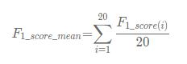

赛题描述
---
在线评论的细粒度情感分析对于深刻理解商家和用户、挖掘用户情感等方面有至关重要的价值，并且在互联网行业有极其广泛的应用，主要用于个性化推荐、智能搜索、产品反馈、业务安全等。本次比赛我们提供了一个高质量的海量数据集，共包含6大类20个细粒度要素的情感倾向。参赛人员需根据标注的细粒度要素的情感倾向建立算法，对用户评论进行情感挖掘，组委将通过计算参赛者提交预测值和场景真实值之间的误差确定预测正确率，评估所提交的预测算法。

数据说明
---
数据集分为训练、验证、测试A与测试B四部分。数据集中的评价对象按照粒度不同划分为两个层次，层次一为粗粒度的评价对象，例如评论文本中涉及的服务、位置等要素；层次二为细粒度的情感对象，例如“服务”属性中的“服务人员态度”、“排队等候时间”等细粒度要素。评价对象的具体划分如下表所示。


每个细粒度要素的情感倾向有四种状态：正向、中性、负向、未提及。使用[1,0,-1,-2]四个值对情感倾向进行描述，情感倾向值及其含义对照表如下所示：


数据标注示例如下：
```
“味道不错的面馆，性价比也相当之高，分量很足～女生吃小份，胃口小的，可能吃不完呢。
环境在面馆来说算是好的，至少看上去堂子很亮，也比较干净，一般苍蝇馆子还是比不上这个卫生状况的。
中午饭点的时候，人很多，人行道上也是要坐满的，隔壁的冒菜馆子，据说是一家，有时候也会开放出来坐吃面的人。“
```


结果提交说明
选手需根据训练的模型对测试集的6大类20个的细粒度要素的情感倾向进行预测，提交预测结果，预测结果使用[-2,-1,0,1]四个值进行描述，返回的结果需保存为csv文件。格式如下：


标注字段说明：


评价标准
我们将以用户评论20个细粒度情感维度下的F1值的均值作为本次比赛结果的评价指标，具体计算方式如下



其中 F1_score(i) 为对应细粒度情感维度下的macro F1值，F1_score_mean 为这20个细粒度情感维度下的macro F1值的均值，即为最终结果的评价指标。 F1_score(i) 可通过以下计算方式得到：


将n分类的评价拆成n个二分类的评价，根据每个二分类评价的 TP, FP, FN 计算出准确率和召回率，再由准确率和召回率计算得到F1_score


功能描述
---
本工程主要用于为参赛者提供一个baseline，方便参赛者快速上手比赛，主要功能涵盖完成比赛的全流程，如数据读取、分词、特征提取、模型定义以及封装、
模型训练、模型验证、模型存储以及模型预测等。baseline仅是一个简单的参考，希望参赛者能够充分发挥自己的想象，构建在该任务上更加强大的模型。

开发环境
---
* 主要依赖工具包以及版本，详情见requirements.txt

项目结构
---
* src/config.py 项目配置信息模块，主要包括文件读取或存储路径信息
* src/data_process.py 数据处理模块，主要包括数据的读取以及处理等功能
* src/model.py 模型定义模块，主要包括模型的定义以及使用封装
* src/main_train.py 模型训练模块，模型训练流程包括 数据读取、分词、特征提取、模型训练、模型验证、模型存储等步骤
* src/main_predict.py 模型预测模块，模型预测流程包括 数据和模型的读取、分词、模型预测、预测结果存储等步骤 


使用方法
---
* 配置 在config.py中配置好文件存储路径
* 训练 运行nohup python main_train.py -mn your_model_name & 训练模型并保存，同时通过日志可以得到验证集的F1_score指标
* 预测 运行nohup python main_predict.py -mn your_model_name $ 通过加载上一步的模型，在测试集上做预测

Base Line repo
---
[AI Challenger git repo](https://github.com/AIChallenger)

Other Information
---
[Word2Vec tutorial](http://mccormickml.com/tutorials/)
