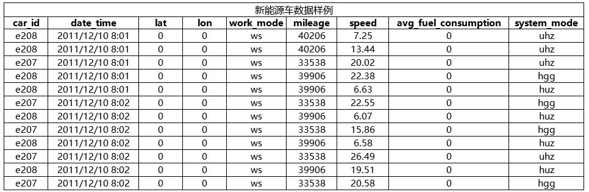
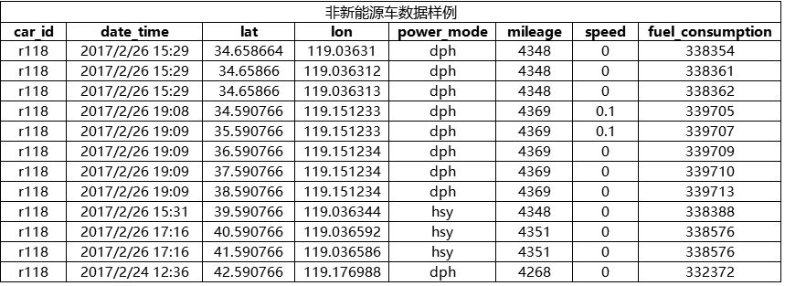
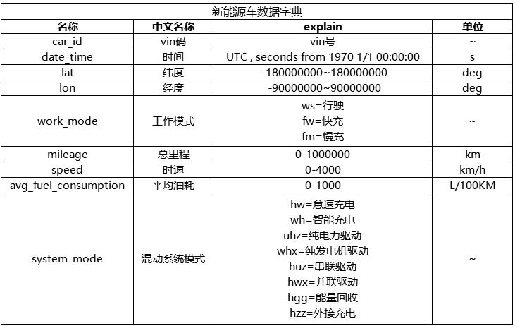
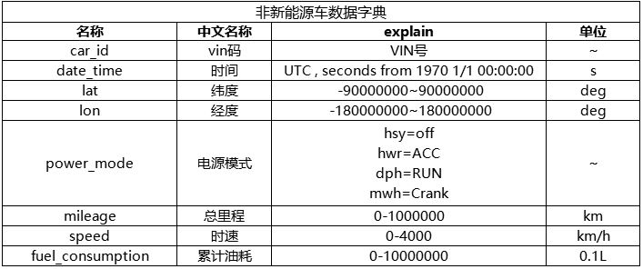
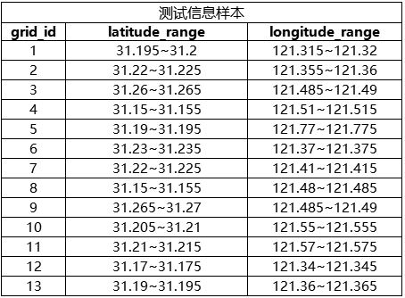

## 赛题说明

随着城市里购车人群的增多，道路拥堵情况日益严重：在中国，有大约超过50个城市面临不同程度的拥堵，城市越大拥堵越严重，不只中国，交通问题是世界大型城市的共同顽疾，据相关数据显示，欧盟境内每年因交通拥堵造成的经济损失达到了1000亿欧元。

如果能够及时评估交通拥堵情况，从时间和空间维度上预测车流量，对城市规划和交通管理会有很大的参考价值。

赛题由大赛主办方之一上汽集团创新打造，提供总共2000辆上汽新能源车和非新能源车历史出行数据（初赛数据集1000辆，复赛数据集1000辆）期待参赛团队运用机器学习和人工智能的技术，开发算法模型，通过算法进行精准车流量预测，探索人工智能技术在汽车出行场景创新应用的更多可能。第三届上海BOT智能汽车数据智能创新应用国际大赛基于“数愿大数据人工智能竞赛平台”，邀请全球汽车、大数据、人工智能等众多领域的专家学者以及创业团队、技术精英参赛。

 

## 赛题说明

参赛团队于初、复赛两个阶段总共将获取2000辆上汽新能源车和非新能源车的20170102-20170326期间10周历史出行数据（初赛数据集1000辆，复赛数据集1000辆），数据集包含了车辆出行的相关字段（比如车辆的经纬度、工作模式等），需要参赛团队在比赛过程中使用合适的机器学习和人工智能技术来深入挖掘并细致分析出行数据进行车流量预测。网格车流量的定义是每个小时内该网格出现的车辆数，计数方式为：同一车辆一个小时内仅计数一次。也就是说，每个网格一小时内出现的不同车辆ID的数目即为该网格这个时间段内的车流量。

大赛主办方上汽集团提供真实汽车出行数据作为大赛数据支持，提供出行数据和测试信息给参赛者训练和比赛使用。参赛者获取数据后，调试算法，提交结果，大赛官网进行排名并定时公布排行榜。参赛队伍可下载数据在本地设计和调试算法。

除比赛提供的车辆出行记录数据之外，参赛者也可以使用其他外部公开数据，但必须提供相关外部数据使用说明文件（包含数据内容描述以及数据使用方法），组委会有权对相关数据与代码进行检验。

## 数据说明

